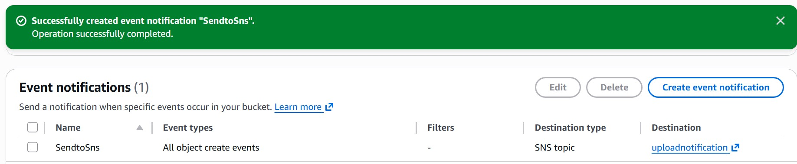
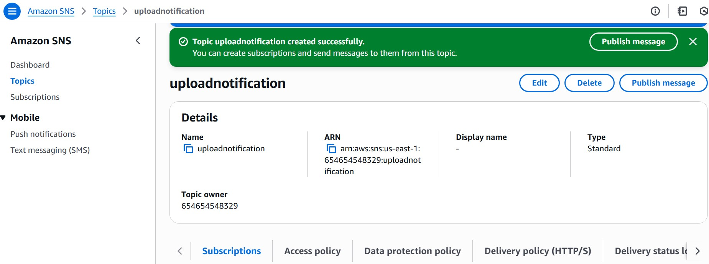
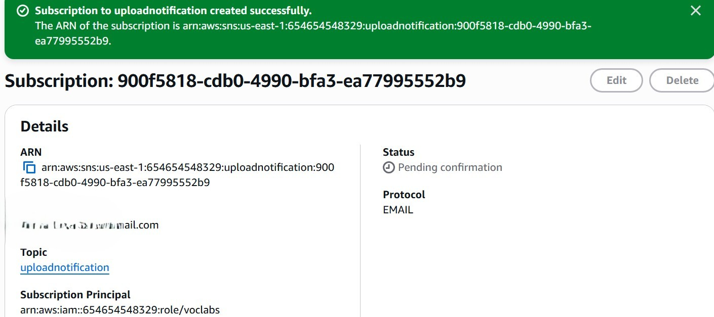
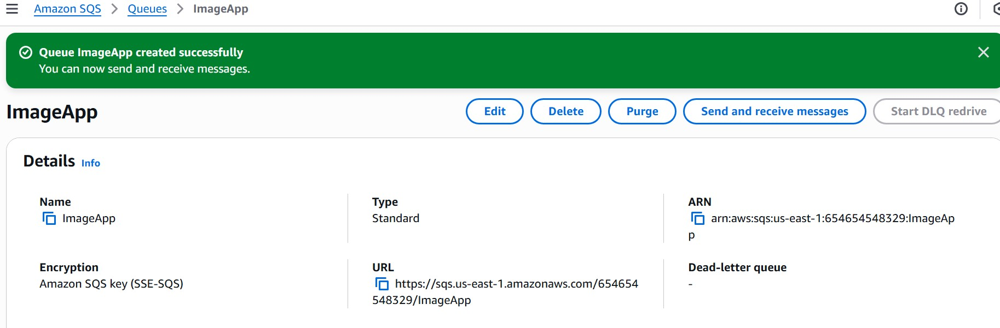

# Building Decoupled Applications with AWS SQS and SNS

##  Overview

This project demonstrates how to design and implement a **decoupled, event-driven cloud architecture** using AWS managed services such as **Amazon S3, Amazon SNS, and Amazon SQS**.

The project is based on a hands-on AWS guided lab and focuses on transforming a **tightly coupled application** into a **scalable, fault-tolerant system** following cloud-native best practices.

---

##  Architecture Overview

### Decoupled Event-Driven Architecture

**Architecture Type:** Event-driven, decoupled  
**Key Benefits:** Fault tolerance, scalability, asynchronous processing

---

##  Application Workflow

The application simulates an **image upload pipeline**:

1. Users upload images through a web interface
2. Images are stored in **Amazon S3**
3. S3 triggers an **SNS notification** on object creation
4. SNS delivers messages to:
   - **Amazon SQS** for asynchronous processing
   - **Email subscribers** for alerts
5. The application server polls **SQS** and processes images independently

This design ensures the system remains operational even if one component fails.

---

## ☁️ AWS Services Used

| Service | Purpose |
|------|------|
| Amazon S3 | Image storage and event triggering |
| Amazon SNS | Publish/subscribe notifications |
| Amazon SQS | Message queue for decoupling components |
| Amazon EC2 | Hosts web and application servers |
| Node.js | Application runtime |

---

##  Architecture Evolution

### Phase 1 – Tightly Coupled Architecture

#### Workflow
- User uploads an image
- Web server directly invokes the application server
- Image is processed synchronously

#### Limitations
- ❌ No fault tolerance  
- ❌ Application server downtime breaks the system  
- ❌ Poor scalability  
- ❌ Tight dependency between components  

This phase highlights why **tightly coupled architectures are unsuitable** for modern cloud-native applications.

---

### Phase 2 – Decoupled Architecture Using AWS

#### Improvements Introduced
- ✅ Amazon SNS for notifications  
- ✅ Amazon SQS for message queuing  
- ✅ Asynchronous processing  
- ✅ Independent scaling of components  
- ✅ Message persistence and reliability  

#### Decoupled Workflow
1. User uploads an image
2. Image is stored in Amazon S3
3. S3 triggers an SNS notification
4. SNS:
   - Publishes message to SQS
   - Sends email notification
5. Application server polls SQS
6. Image is processed asynchronously

Messages remain in SQS **until successfully processed**, ensuring reliability.

---

##  Implementation Screenshots

### Amazon S3 Event Notification

### SNS Topic

### SNS Email Subscription

### Amazon SQS Message Queue

These screenshots provide **visual proof of real AWS resource configuration**.

---

##  Reliability & Fault Tolerance

- Message persistence via SQS prevents data loss
- Components operate independently
- Failures in the application server do not impact uploads
- Asynchronous processing improves system resilience

---

##  Key Learnings

- Decoupling improves availability and scalability
- Message queues prevent system-wide failures
- Event-driven architectures are resilient by design
- AWS managed services simplify distributed systems
- Cloud-native design enables independent scaling

---

##  How to Reproduce 

1. Create an S3 bucket and enable event notifications
2. Configure an SNS topic and email subscription
3. Subscribe an SQS queue to the SNS topic
4. Deploy the application server on EC2
5. Upload an image and observe asynchronous processing

---

##  Conclusion

This project demonstrates how **Amazon SNS and Amazon SQS** can be used together to build **reliable, loosely coupled cloud applications**. By transitioning from synchronous communication to an event-driven architecture, the system achieves **higher availability, better scalability, and improved fault tolerance**.

---

##  Why This Project Matters

✔ Real AWS services  
✔ Event-driven architecture  
✔ Fault-tolerant design  
✔ Cloud-native principles  
✔ Recruiter-ready documentation  

